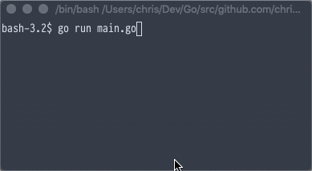

# Spinner
[](https://circleci.com/gh/chriswalker/spinner/tree/master)

A simple spinner for CLI UIs, building upon the spinner outlined in 'The Go Programming Language' book, and some ideas from Brian Downs' [Spinner](http://github.com/briandowns/spinner), mainly around testing and erasing spinner output.



It's a very minimalist implementation with a single spinner 'style', and an API consisting of `Start()` and `Stop()` methods:


```golang
// Creates a default spinner, outputting to os.Stdout
s := spinner.New()
s.Start()
// Do some intensive stuff
s.Stop()
```

An optional prefix can be output by the `Spinner` by passing in an option function in the call to `spinner.New()`:

```golang
s := spinner.New(spinner.Prefix("foo"))
s.Start()
// ...
s.Stop()
```

The spinner structure contains an `io.Writer`; in the default implementation this is just `os.Stdout`, but this can be replaced with something else if required (as is the case for the tests); use the `spinner.Writer()` option function when calling `spinner.New()` to override the default writer.
